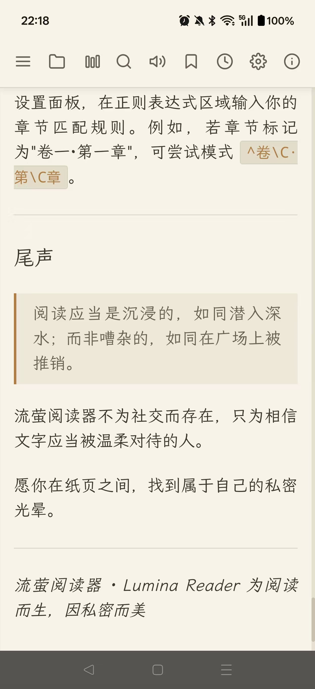
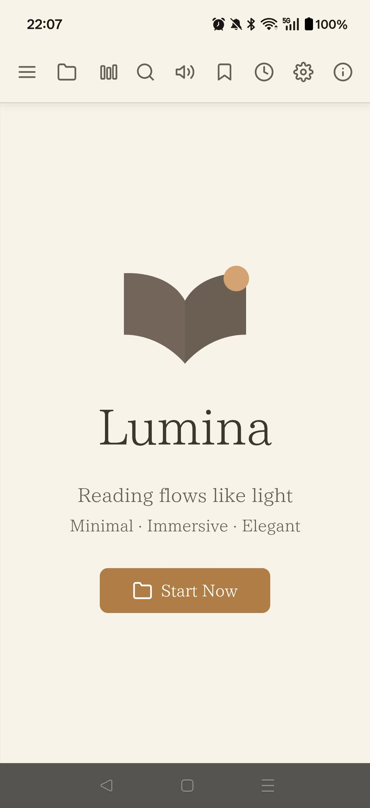
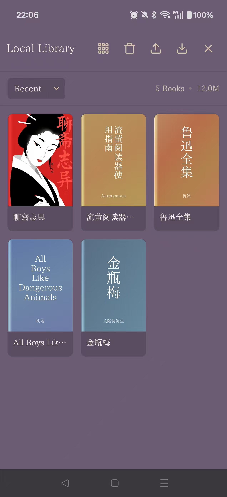
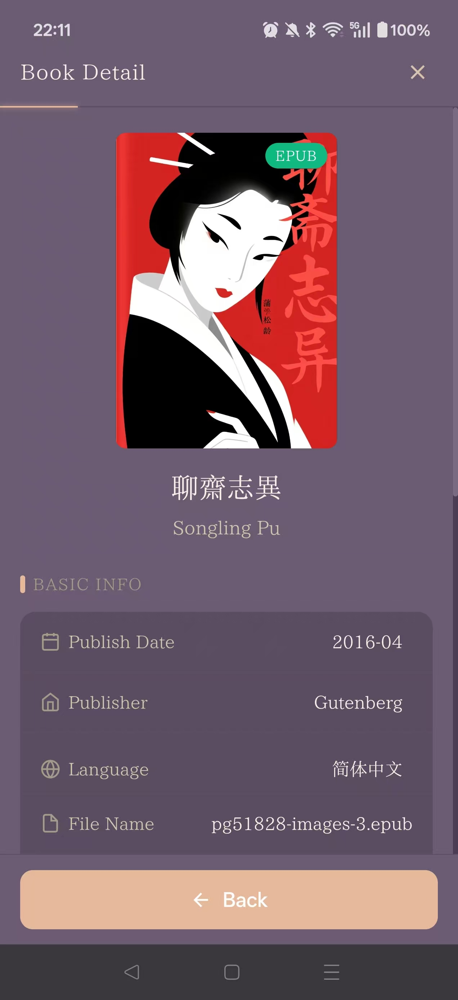
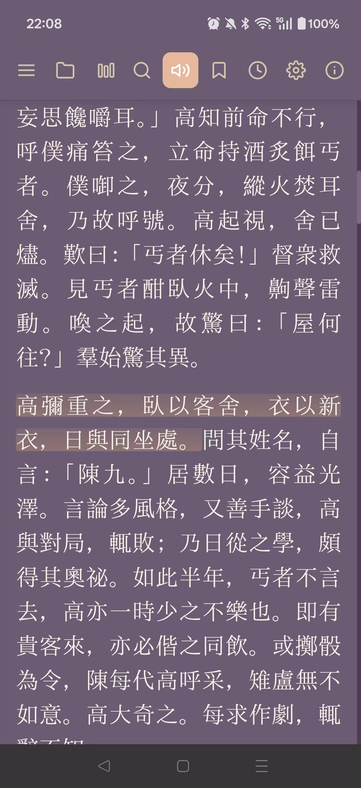
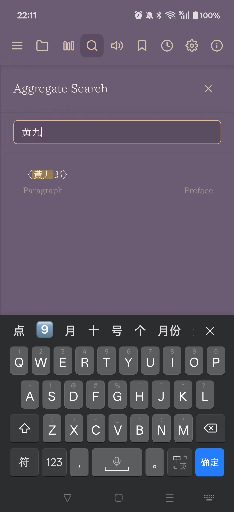
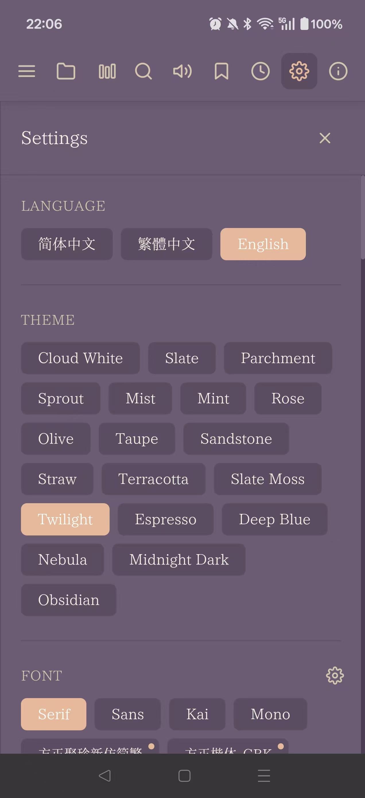

# Lumina Reader 流萤阅读器

一款跨平台的沉浸式文档阅读器，支持 Web 和 Android App。

> **核心特性**：离线优先 · 隐私至上 · 本地存储 · 插件扩展

[](https://opensource.org/licenses/MIT)


## 预览

<p align="center">
  
</p>

| 启动页 | 书库管理 | 书籍详情 |
|--------|----------|----------|
|  |  |  |

| 阅读界面 - 深色 | 全文搜索 | 设置面板 |
|-----------------|----------|----------|
|  |  |  |

---

## 项目结构

```
LuminaReader/
├── app/                          # Android App + Web 共享前端
│   ├── android/                  # Android 原生项目 (Capacitor 6)
│   │   ├── app/src/main/assets/  # Web 资源打包目录
│   │   └── build/                # 构建输出（含 APK）
│   ├── www/                      # 【核心】Web 前端代码（Web/App 共享）
│   │   ├── index.html            # 主页面
│   │   ├── css/                  # 样式文件
│   │   │   ├── main.css          # 主样式（20+ 主题）
│   │   │   ├── markdown.css      # Markdown 渲染样式
│   │   │   ├── book-detail.css   # 书库管理样式
│   │   │   └── share-card.css    # 分享卡片样式
│   │   ├── js/
│   │   │   ├── modules/          # 核心模块
│   │   │   │   ├── namespace.js         # 命名空间初始化
│   │   │   │   ├── config.js            # 运行时配置
│   │   │   │   ├── config-manager.js    # 统一配置管理器
│   │   │   │   ├── utils.js             # 工具函数
│   │   │   │   ├── i18n.js              # 国际化（中/繁/英）
│   │   │   │   ├── parser.js            # 文件解析器
│   │   │   │   ├── chapter.js           # 章节管理
│   │   │   │   ├── renderer.js          # 渲染引擎
│   │   │   │   ├── search.js            # 搜索模块
│   │   │   │   ├── actions.js           # 操作事务
│   │   │   │   ├── ui.js                # UI 交互
│   │   │   │   ├── annotations.js       # 批注系统
│   │   │   │   ├── tts.js               # 语音朗读
│   │   │   │   ├── db.js                # 数据存储层
│   │   │   │   ├── cache-manager.js     # 缓存管理（Web 模式）
│   │   │   │   ├── data-manager.js      # 书库管理
│   │   │   │   ├── settings.js          # 设置管理
│   │   │   │   ├── exporter.js          # 导出功能
│   │   │   │   ├── crypto.js            # AES-256-GCM 加密
│   │   │   │   ├── font-manager.js      # 字体管理
│   │   │   │   ├── cover-generator.js   # 封面生成
│   │   │   │   ├── share-card.js        # 分享卡片
│   │   │   │   ├── book-detail.js       # 书籍详情
│   │   │   │   ├── plugin-manager.js    # 插件系统管理器
│   │   │   │   └── init.js              # 应用初始化
│   │   │   ├── plugins/          # 插件目录
│   │   │   │   ├── markdown/            # Markdown 富文本渲染插件
│   │   │   │   │   ├── markdown.plugin.js
│   │   │   │   │   ├── markdown.parser.js
│   │   │   │   │   ├── markdown.renderer.js
│   │   │   │   │   └── lib/prism/       # 代码高亮库（16种语言）
│   │   │   │   └── azure-tts/           # Azure TTS 插件
│   │   │   │       ├── azure-tts.plugin.js
│   │   │   │       ├── azure-tts.engine.js
│   │   │   │       ├── azure-tts.task-manager.js
│   │   │   │       └── speech-sdk.bundle.js
│   │   │   └── bridges/          # 桥接模块
│   │   │       ├── exporter-bridge.js   # 导出桥接
│   │   │       ├── db-bridge.js         # 数据库桥接
│   │   │       ├── file-opener-bridge.js # 文件打开桥接
│   │   │       └── safe-area.js         # 安全区域处理
│   │   └── assets/               # 静态资源
│   │       ├── fonts/            # 字体文件（霞鹜文楷等）
│   │       └── js/lib/           # 前端 JS 库
│   ├── package.json              # Node 依赖配置
│   └── capacitor.config.json     # Capacitor 配置
├── web/                          # Web 服务器
│   ├── server.py                 # Python HTTP 服务器
│   ├── start.bat                 # Windows 启动脚本
│   └── data/                     # 运行时数据（自动创建，不提交 Git）
├── guide/                        # 架构文档
│   ├── ARCHITECTURE.md           # 核心架构文档
│   ├── APP_ARCHITECTURE.md       # APP 端架构详解
│   └── DATA_STORAGE_ARCHITECTURE.md # 存储架构详解
├── demo/                         # 演示页面
└── README.md                     # 项目说明
```

## 核心设计：一次编写，两处运行

**`app/www/` 是唯一的 Web 前端代码仓库**

- **App**：Capacitor 加载 `app/www/` 打包成 APK
- **Web**：`web/server.py` 直接服务 `app/www/` 目录

---

## 系统要求

| 环境 | 要求 | 说明 |
|------|------|------|
| **Node.js** | v18.x 或 v20.x LTS | 必需，用于 Capacitor 和构建 |
| **npm** | v9.x+ | 随 Node.js 安装 |
| **Python** | 3.7+ | Web 服务器所需 |
| **Java JDK** | 17 | 仅构建 APK 时需要 |
| **Android Studio** | 最新版 | 仅构建 APK 时需要 |

---

## 依赖说明

### npm 依赖（app/package.json）

#### Capacitor 核心
| 包名 | 版本 | 用途 |
|------|------|------|
| `@capacitor/core` | ^8.2.0 | Capacitor 核心库 |
| `@capacitor/cli` | ^8.2.0 | 命令行工具（`npx cap`） |
| `@capacitor/android` | ^8.2.0 | Android 平台支持 |

#### Capacitor 插件
| 包名 | 版本 | 用途 |
|------|------|------|
| `@capacitor-community/sqlite` | ^8.0.1 | **原生存储** - App 端 SQLite 数据库 |
| `@capacitor-community/text-to-speech` | ^8.0.0 | **系统 TTS** - 设备原生语音合成 |
| `@capacitor/filesystem` | ^8.1.2 | **文件系统** - 读写本地文件 |
| `@capacitor/clipboard` | ^8.0.1 | 剪贴板操作 |
| `@capacitor/device` | ^8.0.1 | 设备信息获取 |
| `@capacitor/share` | ^8.0.1 | 系统分享功能 |
| `@capacitor/status-bar` | ^8.0.1 | 状态栏控制（沉浸模式） |

#### 开发依赖
| 包名 | 版本 | 用途 |
|------|------|------|
| `browserify` | ^17.0.1 | 打包工具（用于 Azure TTS SDK） |

### 前端静态库（已内置，无需安装）

位于 `app/www/assets/js/lib/`，直接通过 `<script>` 引入：

| 库文件 | 版本 | 用途 |
|--------|------|------|
| `jszip.min.js` | 3.x | ZIP 压缩/解压（解析 DOCX） |
| `pdf.min.js` + `pdf.worker.min.js` | 3.x | PDF 解析与渲染 |
| `encoding.min.js` | - | 编码检测（UTF-8/GBK/Big5/ANSI） |
| `docx.min.js` | - | DOCX 文档解析 |
| `pinyin-pro.min.js` | - | 拼音转换（PDF 密码智能猜测） |

---

## 快速开始

### 安装依赖

```bash
# 进入 app 目录
cd app

# 安装所有 npm 依赖
npm install
```

### 运行 Web 端（最简单，推荐先尝试）

```bash
cd web

# Windows
start.bat

# 或手动启动
python server.py

# 访问 http://localhost:8080
```

> Web 端仅需 Python，**不需要 npm 安装**。

### 运行 Android App

```bash
cd app

# 首次：同步 Web 代码到 Android
npx cap sync android

# 打开 Android Studio（自动启动模拟器或连接设备）
npx cap open android
```

**构建 APK（命令行方式）：**
```bash
cd app/android
./gradlew assembleDebug
# 输出位置：app/build/outputs/apk/debug/app-debug.apk
```

---

## 开发命令速查表

| 命令 | 说明 | 执行位置 |
|------|------|----------|
| `npm install` | 安装/更新依赖 | `app/` |
| `npx cap sync android` | 同步 Web 代码到 Android | `app/` |
| `npx cap copy` | 快速复制 Web 代码（不更新原生配置） | `app/` |
| `npx cap open android` | 打开 Android Studio | `app/` |
| `python server.py` | 启动 Web 服务器 | `web/` |
| `start.bat` | Windows 一键启动 Web 服务器 | `web/` |

---

## 核心功能

### 文档阅读
- **多格式支持**：DOCX, TXT, Markdown, HTML, PDF
- **智能排版**：首行缩进、首字下沉、行间距、段落间距调节
- **主题系统**：20+ 配色方案，支持深色/浅色模式
- **字体切换**：内置霞鹜文楷等多款字体，支持自定义字体

### 导航与搜索
- **智能目录**：自动检测章节层级（6级支持）
- **全文搜索**：快速定位关键词（支持正则）
- **书签注释**：支持添加书签和文本批注
- **历史记录**：自动保存阅读进度

### G点热力图
- **关键词高亮**：自定义标签，高亮显示敏感内容
- **预设管理**：保存常用标签组合，一键应用
- **智能分析**：自动分析文档热点

### 语音朗读 (TTS)
- **系统 TTS**：使用设备原生语音引擎（无需网络）
- **Azure TTS**：高品质神经网络语音（需配置密钥）
  - 多种音色选择（晓晓、云希等）
  - 角色扮演风格（助手、聊天、新闻等）
  - 智能预加载缓存，流畅朗读
- **朗读控制**：播放/暂停、速度调节、定时停止

### 书库管理
- **本地存储**：支持将书籍保存到本地数据库
- **阅读进度**：自动保存和恢复阅读位置
- **批量导入/导出**：支持多格式导出（TXT/Markdown/HTML/DOCX）
- **加密导出**：支持 AES-256-GCM 加密保护

---

## 配置管理

### 统一配置系统（ConfigManager）

采用集中式配置管理，支持版本控制和迁移：

```javascript
// 配置结构（存储于 localStorage['luminaConfig']）
{
    version: 1,
    reading: { theme, font, fontSize, lineHeight, ... },
    regex: { chapter, section },
    tts: { rate, pitch, voiceURI, volume },
    pagination: { enabled, maxWords, imageWords },
    pdf: { extractImages, passwordPreset },
    export: { encrypted },
    heatMap: { presets: [] },
    azureTTS: { enabled, speechKey, region, voice, style, cache },
    customFonts: [],
    plugins: {},
    meta: { firstInstall, lastBackup, importCount }
}
```

### 配置备份与恢复

- **导出配置**：支持 `.json`（明文）和 `.lmn`（加密）格式
- **导入配置**：跨设备迁移设置
- **加密保护**：AES-256-GCM 加密，支持密码保护
- **跨平台兼容**：Web 和 App 配置文件互通

---

## 插件系统

项目采用插件化架构，核心功能与扩展功能解耦：

```
js/plugins/
├── markdown/              # Markdown 富文本渲染
│   ├── markdown.plugin.js
│   ├── markdown.parser.js
│   ├── markdown.renderer.js
│   └── lib/prism/         # 代码高亮（16种语言，6种主题）
└── azure-tts/             # Azure 语音服务
    ├── azure-tts.plugin.js
    ├── azure-tts.engine.js
    ├── azure-tts.task-manager.js
    └── speech-sdk.bundle.js
```

**插件机制：**
- `plugin-manager.js` 提供钩子系统（`beforeParse`, `createElement`, `afterRender` 等）
- 插件通过钩子扩展功能，不影响核心代码
- 支持启用/禁用，配置持久化

---

## 开发工作流

### 修改前端代码

**所有前端修改都在 `app/www/` 进行**

- HTML: `app/www/index.html`
- CSS: `app/www/css/`
- JS: `app/www/js/`

### 测试

| 平台 | 方式 |
|------|------|
| Web | `web/start.bat` 或 `python server.py`，访问 `http://localhost:8080` |
| App | `npx cap open android` → Android Studio 运行 |

### 同步到 Android

修改 `app/www/` 后同步到 Android：

```bash
cd app
npx cap copy        # 快速复制（开发时用）
# 或
npx cap sync android  # 完整同步（安装新插件时用）
```

**注意**：不需要手动复制到 `web/`，`server.py` 自动读取 `app/www/`。

---

## Git 提交

```bash
# GitHub（主仓库）
git clone https://github.com/li9293019/lumina-reader.git

# 码云（国内镜像）
git clone https://gitee.com/boyryan85/lumina-reader.git

# 日常提交
git add .
git commit -m "feat: xxx"
git push
```

### 不提交的文件

已在 `.gitignore` 中配置：

- `node_modules/` - Node 依赖
- `__pycache__/` - Python 缓存  
- `web/data/` - 运行时数据（书籍、数据库）
- `reference/` - 本地参考文件
- `*.rar`, `*.zip` - 压缩包

---

## 技术栈

| 层级 | 技术 | 说明 |
|------|------|------|
| 前端 | HTML5 + CSS3 + Vanilla JS（ES6 模块化） | 无重型框架，零运行时开销 |
| 移动端 | Capacitor 6 + Android SDK | 现代跨平台方案，接近原生性能 |
| Web 服务器 | Python 3 标准库 | 零依赖，开箱即用 |
| 存储 | IndexedDB (Web) / SQLite (App) | 存储适配器模式，按需适配 |
| 加密 | AES-256-GCM (Web Crypto API) | 浏览器原生加密 API |
| 插件系统 | 基于钩子的事件驱动架构 | 核心与扩展完全解耦 |
| 代码高亮 | PrismJS | 按需加载，轻量高效 |
| 构建工具 | browserify | 打包 Azure TTS SDK |

---

## 功能清单

### 文档支持
- [x] DOCX - Word 文档（支持密码保护、图片提取）
- [x] TXT - 纯文本（智能编码检测：UTF-8/GBK/Big5/ANSI）
- [x] Markdown - 富文本渲染（标题、列表、代码块、表格）
- [x] HTML - 网页文档（标签清理）
- [x] PDF - 支持密码保护和文本提取

### 阅读体验
- [x] 20+ 主题配色
- [x] 字体切换（霞鹜文楷等）
- [x] 自定义字体导入
- [x] 排版自定义（缩进、行距、段距）
- [x] 平滑滚动
- [x] 分页/连续阅读模式

### 导航与标注
- [x] 智能章节检测（6级层级）
- [x] 5种章节编号策略（中文/英文/学术等）
- [x] 自定义正则识别章节
- [x] 全文搜索
- [x] 书签管理
- [x] 文本批注
- [x] 阅读进度同步

### 语音朗读
- [x] 系统 TTS 引擎（离线）
- [x] Azure TTS 高品质语音（在线）
- [x] 语速/音调调节
- [x] 预加载缓存
- [x] 定时停止

### 书库与数据
- [x] 本地书库存储
- [x] 阅读进度自动保存
- [x] 批量导入/导出
- [x] 加密导出（AES-256-GCM）
- [x] 哈希封面生成

### G点热力图
- [x] 关键词高亮
- [x] 标签预设管理
- [x] 一键应用预设

### 配置管理
- [x] 统一配置管理器（ConfigManager）
- [x] 配置导出/导入（.json / .lmn）
- [x] AES-256-GCM 加密
- [x] 跨平台兼容

### 插件系统
- [x] 钩子机制（beforeParse, createElement, afterRender 等）
- [x] Markdown 富文本插件
- [x] 代码高亮（16种语言，6种主题）
- [x] Azure TTS 插件

---

## 相关文档

- [ARCHITECTURE.md](guide/ARCHITECTURE.md) - 核心架构文档
- [APP_ARCHITECTURE.md](guide/APP_ARCHITECTURE.md) - APP 端技术架构
- [DATA_STORAGE_ARCHITECTURE.md](guide/DATA_STORAGE_ARCHITECTURE.md) - 数据存储架构

---

## License

MIT License © 2026
